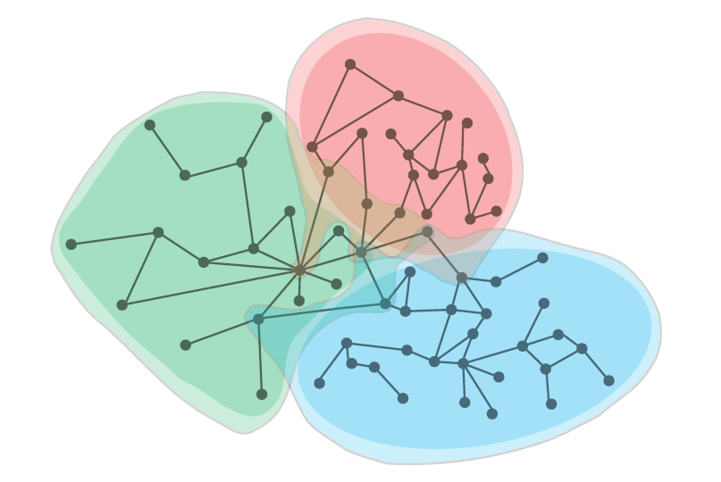

# 基于矩阵分解的图机器学习模型

## 1. Introduction
极大的受到Dimensionality Reduction思想的影响，在图机器学习最早期的研究中涌现了一批基于Matrix Factorization的模型。这类模型往往以重建图的邻接矩阵为目标，学习各个节点的表示。在这篇文章中，我们将介绍其中三篇比较有代表性的工作，包括Graph Factorization[1]，GraRep[2]以及HOPE[3]。同时，在文章最后我们也提供了这三个模型的Pytorch Demo。因笔者能力有限，若有谬误，请不吝指正！

## 2. Graph Factorization
GF[1]是Google在13年提出的一篇文章，可以说是最早的图机器学习模型之一。它的思想在今天看来十分简单粗暴。

### 2.1 Objective Function

我们直接上目标函数：

其中，为节点之间的边权重，为节点的表示，为节点的表示，为正则系数。在整篇专栏中，我们将尽可能统一各符号的含义，因此公示符号会和原论文中的略有不同。

显然，这是一个简单的目标函数加上一个正则项。该目标函数希望节点对的表示的内积可以重建。当为边权重时，该目标等同重建图的邻接矩阵。换句话说，该目标可以看作是一个关于的回归模型，因此这也往往要求是连续的，否则模型效果可能会有极大的损失。值得一提的是，尽管原论文中没有提到，但这里的也可以为任意的一维（连续）edge feature。

### 2.2 Graph Partitioning
这个损失函数的设计思路是显而易见的，但该模型存在一个显著的问题。即，当图中节点数量较大，并且嵌入的维度不小时，我们可能很难将整张图存在单个机器的内存中。

显然，为了解决这一问题，一个思路就是将图数据分布式的存储在集群中，后进行分布式的训练。比如，我们可以直接利用流行的Graph Partitioning算法，如METIS等，将图分割为互不重叠的多个簇。之后，集群中的一台机器仅存储一个簇的数据，并只更新该簇中节点的表达。然而，这个简单的思路可能会使簇中节点丢失部分一阶邻居，致使信息损失、模型效果下降。

那么一个直观的降低信息损失的思路就是：额外保留簇中各个节点存在于簇外的一阶邻居。倘若能做到这一点，那么基于上述目标函数进行优化时，就不会发生信息的丢失。基于这一思路，该文章提出了一个Graph Partitioning算法，使得该优化过程scalable，而这个算法事实上才是这篇文章的主要贡献。

该文章提出的算法如上图所示，经该图分割算法后，每个簇包含两个部分，一个部分是与其它各个簇均不重合的节点，即上图颜色较亮的部分；另一部分是，即上图颜色较暗的部分，这一部分的节点会存在于多个簇中，目的是为了确保中各个节点均能找到对应的一阶邻居。最终一台机器会存储的节点的集合为。作者们称 is *owned* by machine  and  is *borrowed* by machine ，可以说是比较形象的。

然而，因为存在于中的节点会存在于不同的簇中，所以它们的表达会在不同的簇中独立的被更新。这就可能会导致这些节点的表达难以收敛。那么一个直观的思路就是在损失函数中约束，其中和均是learnable parameters，但是代表节点在机器上的“临时”表达，仅仅是辅助参数，而才是节点最终的表示。

这个约束可以促使各个机器上的最终收敛，不会发散。而将该约束植入损失函数的一个直接的方法则是利用Lagrange Multiplier，最终该模型损失函数为：

最后的问题则是，我们实现这个图分割算法呢？由上述思路我们可以看见，为了使中节点的表达收敛，我们不得不在集群中进行数据的交换传输，倘若很大的话，那么机器之间数据交流的代价可能非常昂贵。因此，不同于旨在最小化edge cuts的主流图分割算法，该文章提出了一个最小化各个簇的一阶邻居数量的图分割算法。显然，最小化这个目标是一个NP-hard的问题，因此作者们提出了一个贪婪策略，使得尽可能的小，以提升算法的效率。该算法的具体流程，我们请读者参阅原论文Section 5.2.

### 2.3 Summary
这篇文章总体来说非常的Google，很偏向落地应用。重点在于模型的大规模部署训练，而不是特定的目标函数。

事实上，ClusterGCN[4]（也是一篇Google的文章）跟这篇文章有异曲同工之妙。不同的是，ClusterGCN基于GCN，簇间的信息损失远不止节点的部分一阶邻居而已，而倘若要维护各个簇在簇外的阶邻居，那么代价可能又过高了。因此ClusterGCN的可扩展性建立在簇间的信息损失之上。

总体来说，该模型的优点有：

- Inductive
- Scalable

该模型的局限性有：

- 往往仅适用于连续的，且仅能捕捉节点间的一阶关系
- 模型仅输入，故而缺少"负"样本，可能出现较多的"False Positives"
- Embedding lookup矩阵后直接跟损失函数，模型表达能力有限、节点间无参数共享
- 无法利用节点的特征

## 3. GraRep

## 4. HOPE

## 5. References
[1] Amr Ahmed, Nino Shervashidze, Shravan Narayanamurthy,
Vanja Josifovski, and Alexander J Smola. Distributed
large-scale natural graph factorization. In
Proceedings of the 22nd international conference on
World Wide Web, pages 37–48, 2013.

[2] Shaosheng Cao, Wei Lu, and Qiongkai Xu. Grarep:
Learning graph representations with global structural
information. In Proceedings of the 24th ACM international
on conference on information and knowledge
management, pages 891–900, 2015.

[3] Mingdong Ou, Peng Cui, Jian Pei, Ziwei Zhang,
and Wenwu Zhu. Asymmetric transitivity preserving
graph embedding. In Proceedings of the 22nd ACM
SIGKDD international conference on Knowledge discovery
and data mining, pages 1105–1114, 2016.

[4] Wei-Lin Chiang, Xuanqing Liu, Si Si, Yang Li, Samy
Bengio, and Cho-Jui Hsieh. Cluster-gcn: An efficient
algorithm for training deep and large graph convolutional
networks. In Proceedings of the 25th ACM
SIGKDD International Conference on Knowledge Discovery
& Data Mining, pages 257–266, 2019.

